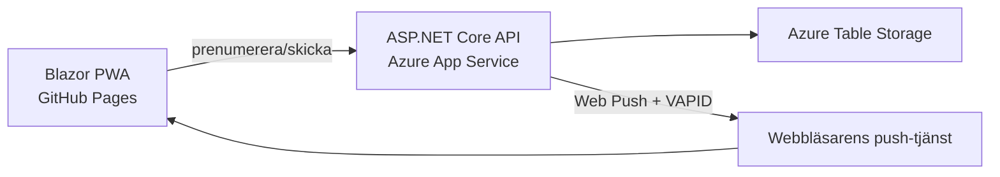

# Notifications

En .NET 10 Blazor WebAssembly-PWA med MudBlazor och ett Azure-inspirerat `MudTheme`. Klienten publiceras på GitHub Pages. Ett ASP.NET Core-API i Azure App Service lagrar prenumerationer i Azure Table Storage och skickar krypterade Web Push-meddelanden med VAPID.

## Funktioner

- Aktivera och stäng av pushnotiser från PWA:n.
- Ta emot notiser när appen inte är öppen.
- Skicka rubrik, text och valfri länk till alla aktiva prenumeranter.
- Automatisk borttagning av utgångna prenumerationer (`404`/`410`).
- Offline-cache, installationsmanifest och ikoner för PWA.
- Validering, CORS, rate limiting och konstanttidsjämförelse av administratörsnyckeln.
- GitHub Actions för CI, GitHub Pages och Azure App Service.
- Bicep-mall för App Service, Linux-plan, Storage Account och Table Storage.

## Arkitektur



GitHub Pages kan bara servera statiska filer. Därför måste sändning och lagring ligga i Azure; VAPID-privatnyckeln får aldrig finnas i WASM-klienten.

## Lokal körning

Krav: .NET 10 SDK och Node.js (`npx` används bara för att skapa nycklar).

1. Skapa VAPID-nycklar:

   ```bash
   npx web-push generate-vapid-keys
   ```

2. Lägg hemligheterna i API-projektets User Secrets:

   ```bash
   dotnet user-secrets set "Push:Subject" "mailto:din-adress@example.com" --project src/Notifications.Api
   dotnet user-secrets set "Push:PublicKey" "DIN_PUBLIC_KEY" --project src/Notifications.Api
   dotnet user-secrets set "Push:PrivateKey" "DIN_PRIVATE_KEY" --project src/Notifications.Api
   dotnet user-secrets set "AdminKey" "EN_LANG_SLUMPMASSIG_NYCKEL" --project src/Notifications.Api
   ```

3. Starta API och klient i var sitt terminalfönster:

   ```bash
   dotnet run --project src/Notifications.Api
   dotnet run --project src/Notifications.Client
   ```

Utan `Storage:TableConnectionString` använder lokal utveckling ett minneslager. För beständig lokal lagring kan anslutningssträngen peka på Azurite.

## Skapa Azure-resurser

Välj ett globalt unikt appnamn. GitHub Pages-origin ska sakna avslutande snedstreck.

```bash
az login
az group create --name notifications-rg --location swedencentral
az deployment group create \
  --resource-group notifications-rg \
  --template-file infra/main.bicep \
  --parameters \
    appName=DITT_UNIKA_APPNAMN \
    adminKey='EN_LANG_SLUMPMASSIG_NYCKEL' \
    vapidPublicKey='DIN_PUBLIC_KEY' \
    vapidPrivateKey='DIN_PRIVATE_KEY' \
    vapidSubject='mailto:din-adress@example.com' \
    clientOrigin='https://gntestx.github.io'
```

Kommandot skriver ut API-adressen. Testa sedan `https://DITT_UNIKA_APPNAMN.azurewebsites.net/health`.

## Koppla GitHub Actions

I repositoryt `gntestx/Notifications`:

1. Lägg till repository-variabeln `API_BASE_URL`, till exempel `https://DITT_UNIKA_APPNAMN.azurewebsites.net/`.
2. Lägg till repository-variabeln `AZURE_WEBAPP_NAME` med App Service-namnet.
3. Konfigurera Azure Deployment Center för GitHub Actions med **OpenID Connect**. Lägg därefter in secrets `AZURE_CLIENT_ID`, `AZURE_TENANT_ID` och `AZURE_SUBSCRIPTION_ID` om Deployment Center inte gjorde det.
4. Under **Settings → Pages**, välj **GitHub Actions** som källa. Workflow-filen försöker också aktivera Pages automatiskt.
5. Kör workflow `Deploy API to Azure App Service`, därefter `Deploy PWA to GitHub Pages`.

PWA-adressen blir `https://gntestx.github.io/Notifications/`.

## iPhone och iPad

Web Push på iOS/iPadOS kräver att webbappen först läggs till på hemskärmen. Öppna sedan den installerade appen och tryck **Aktivera notiser**. Behörighetsfrågan måste utlösas av användarens knapptryckning. Testa med en fysisk enhet; vanlig Safari-flik och simulator ger inte samma beteende.

## Säkerhet före skarp användning

Administratörsnyckeln skrivs in per utskick och sparas inte av appen. Det är tillräckligt för en liten intern app, men för en publik produktionstjänst bör utskicks-API:t skyddas med Microsoft Entra ID eller annan riktig inloggning. Begränsa även Azure-loggar så att request headers inte lagras och rotera både admin- och VAPID-nycklar vid misstänkt läckage.

## Test

```bash
dotnet restore Notifications.slnx
dotnet build Notifications.slnx --configuration Release --no-restore
dotnet test tests/Notifications.Api.Tests/Notifications.Api.Tests.csproj --configuration Release --no-build
```
